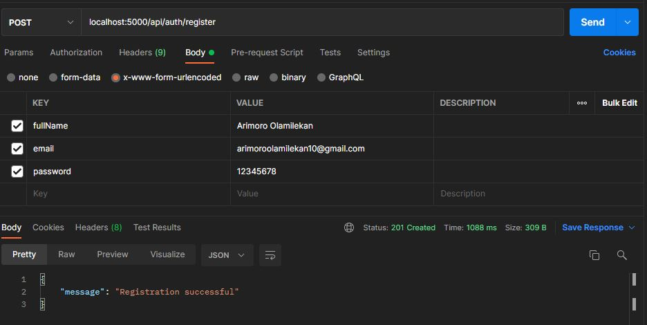
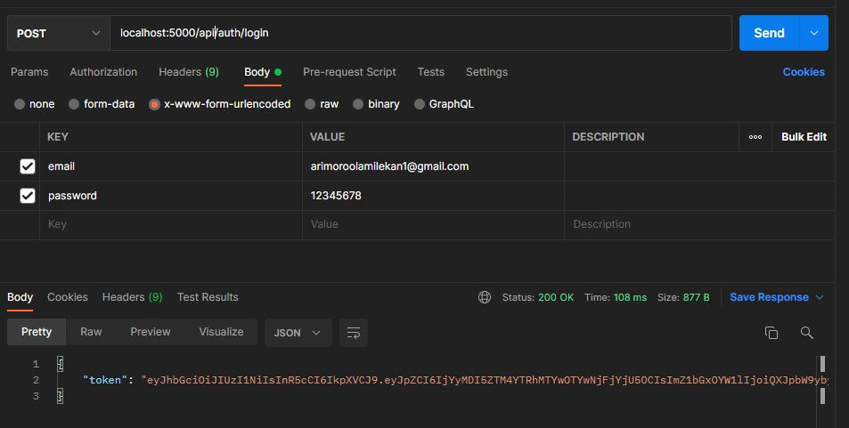
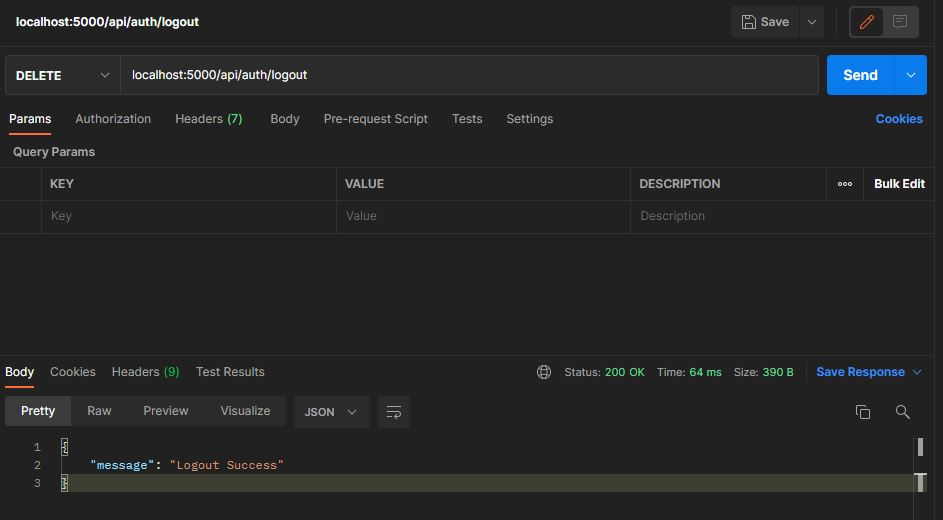

# Workover-Backend

The Backend repository for Workover Platform

## Getting Started

If this is your first time running this project, first install the dependencies in the root directory using npm. We use npm as our package manager.

```bash
npm i
```

### Tools to Install

- [Install MongoDB](https://docs.mongodb.com/manual/administration/install-community/)
- [Install Postman to test api](https://www.postman.com/downloads/)
- [Install MongoDB GUI to see the database](https://robomongo.org/download)

## Steps to run server locally

- Run server locally using the command below

```bash
npm run dev
```

## Steps to test api on postman

1. Open Postman and follow the steps below to test the sign up endpoint

- Since it is running locally on port 5000, in a new tab add **localhost:5000/api/auth/register** and change the request to a POST request.
- Add the sign up data to the body of the request in a tab called _x-www-form-urlencoded_.
- Hit the send button to post the request.

The Picture Below shows how your request should look like



2. Open Postman and follow the steps below to test the sign in endpoint

- Since it is running locally on port 5000, in a new tab add **localhost:5000/api/auth/login** and change the request to a POST request.
- Add the sign in data to the body of the request in a tab called _x-www-form-urlencoded_.
- Hit the send button to post the request.

The Picture Below shows how your request should look like



3. Open Postman and follow the steps below to test the Logout endpoint

- Since it is running locally on port 5000, in a new tab add **localhost:5000/api/auth/logout** and change the request to a DELETE request.
- Hit the send button to process the request.

The Picture Below shows how your request should look like


