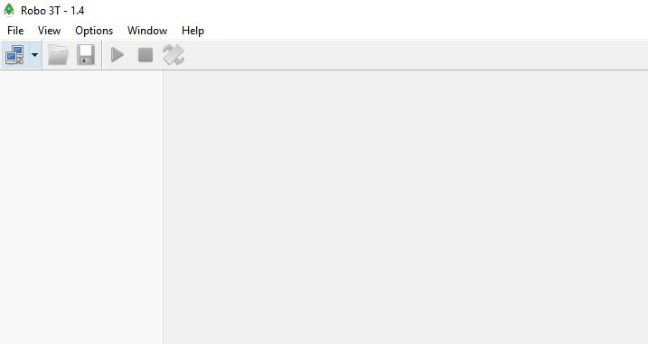
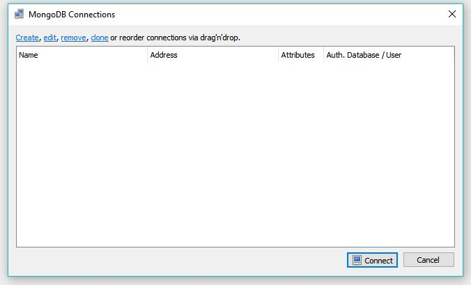
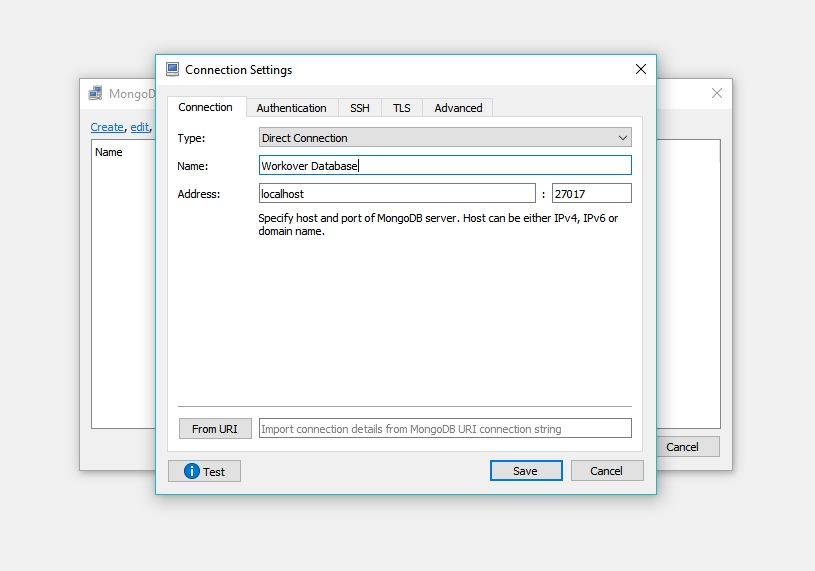
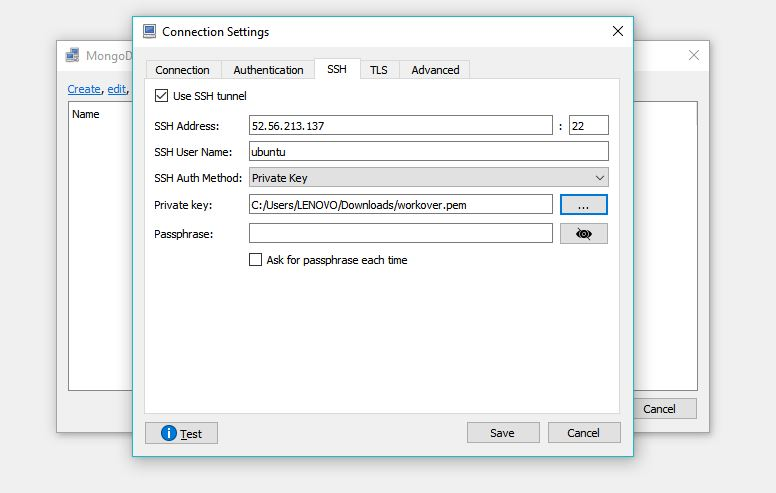
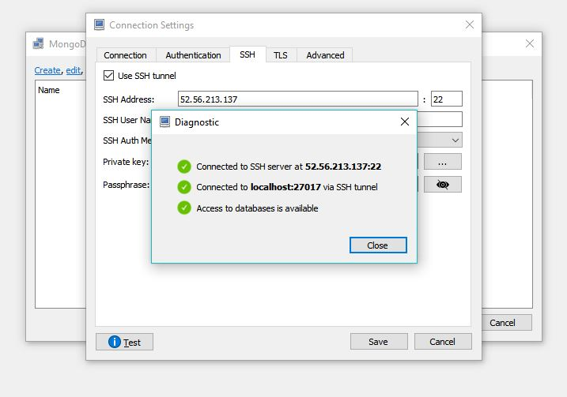
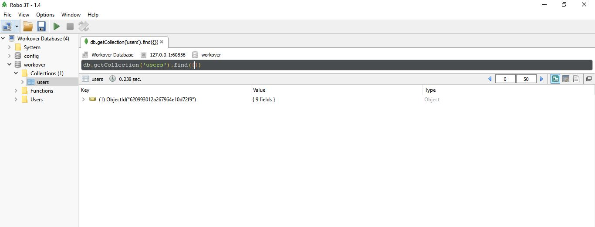

# Workover-Backend

The Backend repository for Workover Platform

## Getting Started

If this is your first time running this project, first install the dependencies in the root directory using npm. We use npm as our package manager.

```bash
npm i
```

### Tools to Install

- [Install MongoDB](https://docs.mongodb.com/manual/administration/install-community/)
- [Install Postman to test api](https://www.postman.com/downloads/)
- [Install MongoDB GUI to view the database](https://robomongo.org/download)

## Steps to run server locally

- Run server locally using the command below

```bash
npm run dev
```

## Setting up MongoDB GUI for remote database.

The steps below shows how to download, install and set up a MongoDB GUI for the remote database that is hosted on AWS:

- Download [Robo3T](https://robomongo.org/download) and install it.
- The interface of the installed app should look like the image below.
  
- Click on the active tab according to the image above which is for a new database connection.
- Click on the Create option to create a new connection.
  
- Name the connection a name of your choice, but in this case use Workover Database.
  
- In the SSH tab, check the box that will make you Use SSH tunnel.
- Fill in the SSH Address which can be gotten from the AWS EC2 instance as Public IPv4 address.
- Fill in the User Name and in the case the username is ubuntu as shown in the picture below.
- Select Provate Key option.
- Browse for the Private Key that was downloaded when setting up AWS instance.
  
- Test the connection to know if it will work and it should display like the picture below.
  
- Finally, save the connection and click on connect to connect to view the database.

The view of the database should look like the picture below.

